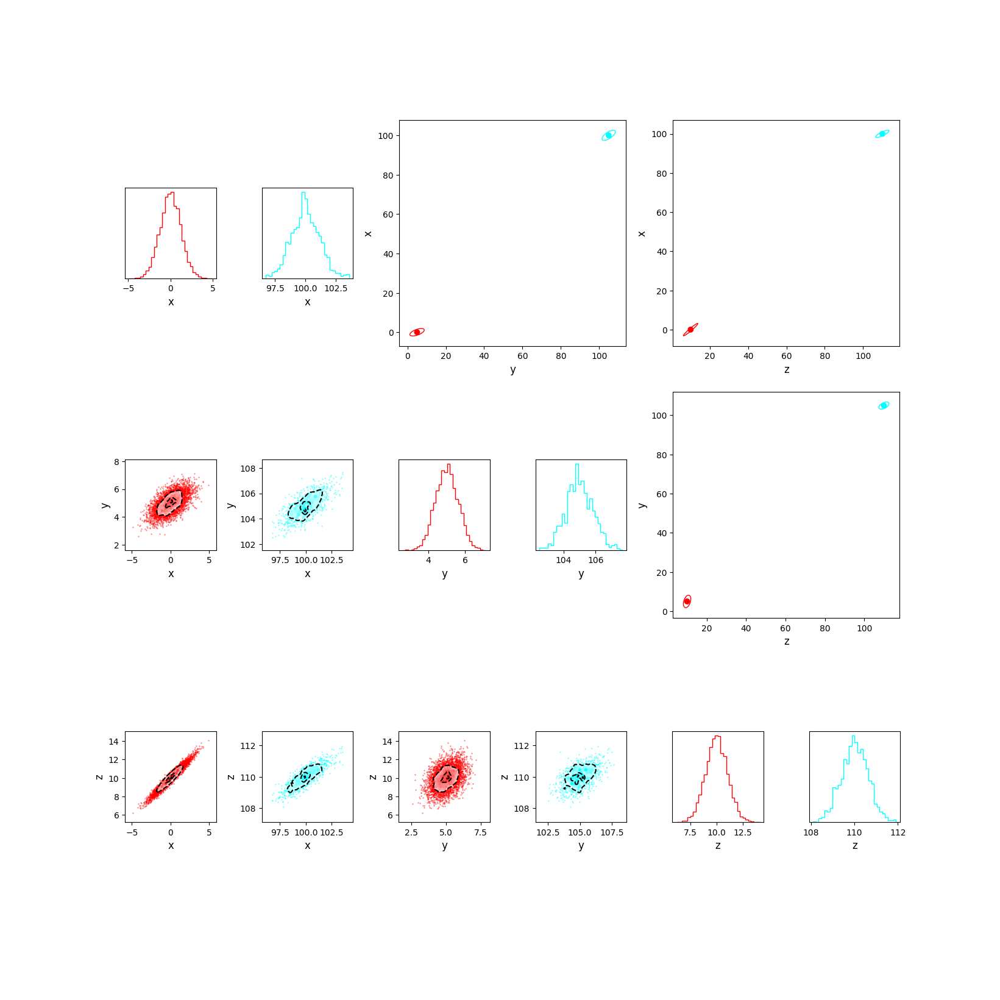

---
title: 'Multicorner.py: pairplots for multi-modal distributions'
tags:
  - Python
authors:
  - name: Zachary Murray
    orcid: 0000-0002-8076-3854
    equal-contrib: true
    affiliation: "1" # (Multiple affiliations must be quoted)
affiliations:
 - name: Research Excellence Fellow, Université Côte d'Azur, France
   index: 1
date: 10 February 2025
bibliography: references.bib

# Summary

Pairplots (also known as Corner Plots and Scatterplot matrices) are one of the best
ways of visualizing high dimensional data. Starting with *corner.py* (originally
*triangle*) by Dan Foreman-Mackey (Foreman-Mackey 2016), corner plots have been
used extensively in all fields of the physical and computer sciences for
visualizing high dimensional data, especially the output of MCMC chains and other
sampling methods [@corner].

The result is the production of several similar packages, all specialized to create
corner plots for one application or another, for example, ChainConsumer [@Hinton2016],
specialized in processing EMCEE or other sampling method output, whose greatest
advantages include the ability to sample multimodal posteriors. Seaborn, used for
machine learning, also includes a pair plot alternative as part of its packaging
[@seaborn]. Pairplots.jl is a solution for Julia users [@pairplotsjl].

Other packages, like cornerhex [@cornerhex], improve on the same concept by representing
the density distribution using hexagonal, rather than square bins, as hexagonal bins
(being more circular) result in greater effective packing efficiency and less distortion
[@Carr_1987].

However, whether applied to MCMC samples, or multivariate data generally, all these
approaches are less effective when there is a significant separation in scale between
individual modes of a posterior and the distances between them. Fortunately, this type
of strong scale-separation is ideal for clustering algorithms. **Multicorner** is a
highly customizable package that mixes the visualization capabilities of corner/pairplots
with clustering algorithms to visualize highly multimodal and multidimensional datasets.

# Statement of Need

Corner plots featuring widely separated yet compact distributions are relatively rare
compared to single-modal cases but still occur frequently across various scientific
fields. Such distributions often arise in periodic models when datasets lack sufficient
information to constrain periodicity. For example, this issue can manifest in orbital
parameter estimation [@Blunt_2017], the determination of asteroid pole orientations
[@Magnusson_1986], but are not exclusive to them and can also occur in non-periodic
scenarios such as spectroscopy [@Damiano_2023].

More broadly, multimodal distributions may also result from underestimated error bars
[@Hogg_2010], often due to unaccounted-for or underestimated systematic errors. As
astronomical observations improve in quality and characterization while random errors
decrease, systematic uncertainties will play an increasingly critical role in data
analysis.

Furthermore, scale separation is a common phenomenon in large datasets. For example,
in geographic data, tightly clustered points (e.g., within cities) may be separated by
vast distances, coral reefs may be distributed across large oceanic expanses, and
similar scale-separated patterns emerge in various domains. Given the prevalence of
such scale-separated distributions, a dedicated visualization tool is urgently needed.

## Example Visualization

The following is a simple demonstration of a visualization made with *multicorner*:

{ width=100% }

And a visualization using *corner.py* for comparison:

{ width=100% }

# Reading the Plot

These plots, produced by *multicorner*, are divided into three main parts:

1. **The lower triangle** – Much like a traditional corner plot, the lower triangle presents
   information about each distribution in a grid of subplots. These are equivalent to a corner
   plot for each individual *mode* that makes up the dataset.

2. **The diagonal** – The diagonal displays histograms of each individual *mode* in the dataset,
   similar to a traditional corner plot.

3. **The upper triangle** – The upper triangle illustrates the relative positions of the *modes*
   within the dataset. It provides insight into the large-scale distribution of data, whereas the
   diagonal and lower triangle highlight smaller-scale details. Since it focuses only on large-scale
   features, the lower triangular panel can be scaled to give a sense of the relative orientation
   of the covariances between modes.

# References
